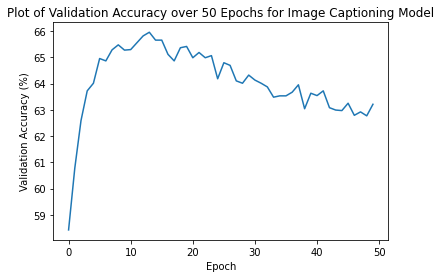

# Image Captioning Project
Authors: Thai Hoang, Van Quach

# Abstract
Image Captioning, which can be defined as automatically generating textual description of an image, is a task very close the the heart of scene understanding - one of the primary goals of computer vision. It combines the knowledge of both computer vision and natural language processing since it requires solving the problem of determining objects within an image as well as expressing the relationships of those objects in natural language. Also, image captioning is believed to help in the process of developing assistive technologies that eliminate technology barriers for visually impaired people.

In this project, our team will create a neural network architecture to automatically generate captions from images.

# Related Work

## Model Architecture
Several methods have been proposed for generating image
descriptions. Many of these methods are based on recurrent neural networks and inspired by the successful use of sequence to sequence training with neural networks for machine translation (Cho et al., 2014;Bahdanau et al., 2014;
Sutskever et al., 2014). One major reason image caption
generation is well suited to the encoder-decoder framework
(Cho et al., 2014) of machine translation is because it is
analogous to “translating” an image to a sentence.

Thus, the task of image captioning can be logically divided into two parts where the first part is an image-based model that is responsible for extracting the features and nuances of an image, and the second part is a language-based model that translates the objects and features given by the image-based model to a natural sentence. (*)

## Dataset

The datasets we will use are MS COCO dataset for images and Karpathy's split for captions.

MS COCO dataset is a publicly available large-scale dataset that are usually used in object detection, segmentation, and image captioning. Its original version, which contains images, bounding boxes, labels, and captions, are split by Karpathy and Li (2015), leading to the appearance of Karpathy's split. This effectively divides the original COCO 2014 validation data into new 5000-image validation and test sets, plus a "restval" set containing the remaining ~30k images. All splits have caption annotations. Thus, the .json file that we got from Karpathy's split will be used as "annotations" for us. 

The train set can be downloaded here:
http://images.cocodataset.org/zips/train2014.zip

The validation set can be downloaded here:
http://images.cocodataset.org/zips/val2014.zip

The "annotations" portion can be downloaded here:
http://cs.stanford.edu/people/karpathy/deepimagesent/caption_datasets.zip

# Concepts
- Encoder-Decoder architecture: An Encoder is used to encode the input into a fixed form that the machine can use and an Decoder is used to decode that input, word by word, into a sequence.
- Attention: is an interface that connects the encoder and decoder. With this technique, the model is able to selectively focus on valuable parts (i.e. pixels) of the input (i.e. image) and learn the association between features within an image.
- Beam Search: is a heuristic search algorithm. It is usually used in NLP as a final decision-making layer to choose the best output given the target variables, such as choosing the maximum probability or the next output character.
- BLEU (BiLingual Evaluation Understudy): BLEU can be seen as the most widely used evaluation indicator; however, its initial intention of the design was not for the image captioning problem, but machine translation problems. BLEU is used to analyze the correlation of n-gram between the to-be-evaluated translation statement and the reference translation statement.

# Experiments
Our final model, similarly to mentioned in (*), is a Convolutional Neural Network - Recurrent Neural Network (RNN - CNN) framework with Attention technique and Beam Search to solve the task of image captioning, which integrates both computer vision and natural language processing. Finally, we evaluated our model using BLEU scores.

## Pre-processing Data
The first step is cleaning the data, because we want to make out data be in the right format to fit in our model.

### Cleaning Data
We decided to only have a portion of the dataset due to time constraint and the lack of CPU memory. To be specific, we reduced the size of the training dataset to be 10,000 images, the validation dataset to be 1,000 images, and the testing dataset to be 2,500 images.

### Image Pre-processing
Since we are using a pretrained Encoder, here is the pretrained ImageNet ResNet-101 on PyTorch, pixel values must be in the range `[0, 1]`. The images fed to the model should be a `Float` tensor and should also be normalized by the mean and standard deviation of the ImageNet images' RGB channels.
```python
mean = [0.485, 0.456, 0.406]
std = [0.229, 0.224, 0.225]
```

### Captions Pre-processing
- Format: `<start>`[`caption right here`]`<end>` because we want the decoder to know when to begin and to end the decoding process of a sentence. Since we pass the captions around as fixed size Tensors, we need to pad captions (which are naturally of varying length) to the same length with `<pad>` tokens.
- Processing format: captions fed to the model must be an `Int` tensor of dimension `N, L` where `L` is the padded length.
- Tokenization: We created a dictionary that maps all unique words to a numberical index. Thus, every word we come across will have a corresponding integer value that can be found in this dictionary.

## Model Details
### Model Baseline
We used the "CNN Encoder and Attention RNN Decoder with Beam Search" as our baseline model. The optimizer that we used was Stochastic Gradient Descent (SGD) optimizer. 

### Encoder
The Encoder is a CNN model. Its goal is to encode the input image with 3 color channels into a smaller image with "learned" channels. In our project, we used the pretrained ResNet-101 model, but we removed the last 2 layers of it (which are the linear and pool layers) since we are not doing classification.


### Decoder
The Decoder is an RNN (LSTM) model. Its goal is to look at the encoded image and generate a caption word by word.

Normally, without Attention mechanism, we could average the encoded image across all pixels. The resulting image of this can then be fed into the Decoder as its first hidden state, with or without a linear transformation, and the caption would be generated from each predicted word. Here, a weighted average is used instead of the simple average, with the weights of the important pixels being higher. This weighted representation of the image can be concatenated with the word that preceded it at each step to produce the next one.

However, with Attention mechanism, we would like the Decoder to focus on different parts of the image at different points in the sequence. For instance, imagine that we want to generate the word `football` in `a man holds a football` then the Decoder would know that it should focus on the football itself.


### Attention
As mentioned before, the Attention is used to compute weights. The algorithm takes into account all the sequences generated thus far, and then proceeds to describe the next part of an image.


In this project, we used Soft Attention, where the weights of the pixels add up to 1. If there are `P` pixels in our encoded image, then at each timestep `t`.

<p align="center">

</p>

In the context of text, it refers to the capability of the model to assign more importance to certain words within a document relative to others. For example, if we are reading a document and have to answer a question based on it, concentrating on certain tokens in the document might help you answer the question better, than to just read each token as if it were equally important.

To sum up, the entire process of this step can be described as computing the probability that a pixel is the place to look to generate the next word.

### Final Model


The general process of each step in building the model is as follows:
- Once the Encoder finishes generating the encoded image, some types of transformation will be performed to create the initial hidden state `h` (and cell state `C`) for the RNN (LSTM) Decoder.
- At each Decoder step:
    - The encoded image along with the previous hidden state is used to generate weights for each pixel in the Attention network.
    - The previously generated word and the weighted average of the encoding are then fed to the LSTM Decoder to continue generate the next word.

### Beam Search
We do not want to decide until we've finished decoding completely since we want to choose the sequence with the highest overall score. Thus, we would like to use Beam Search to assist us in implementing this purpose.

The general process of Beam Search is as follows:
- At the first decoding step, consider the top `k` candidates.
- Generate `k` second words for each of those `k` first words.
- Choose the top `k` [first word, second word] combinations considering additive scores.
- For each of these `k` second words, choose `k` third words and choose the top `k` [first word, second word, third word] combinations.
- Repeat at each decoding step.
- After `k` sequences terminate, choose the sequence with the highest overall score.


Some sequences (striked out) may fail early, as they don't make it to the top k at the next step. Once k sequences (underlined) generate the <end> token, we choose the one with the highest score.

# Training
We train our model using Google Collaborative GPU.
## Hyperparameters:
- Optimizer: Adam optimizer.
- Criterion: Cross-Entropy loss.
## Training Result:
After training over 50 epochs, our result are as follows:
### Train Loss
<p align="center">

</p>

### Train Accuracy
<p align="center">

</p>

### Val Loss
<p align="center">

</p>

### Val Accuracy
<p align="center">

</p>

# Evaluation
We used BLEU4 score to evaluate our model. After 50 epochs, our BLEU4 score ended up to be 0.1559.
<p align="center">

</p>

# Demo


# Conclusion


# Video Description
The video description of this project can be found here.

# References
sgrvinod. (n.d.). sgrvinod/a-pytorch-tutorial-to-image-captioning: Show, attend, and tell: A pytorch tutorial to image captioning. GitHub. Retrieved March 18, 2022, from https://github.com/sgrvinod/a-PyTorch-Tutorial-to-Image-Captioning 

K. Xu, J. Ba, R. Kiros, A. Courville, R. Salakhutdinov, R. Zemel, and
Y. Bengio, “Show, attend and tell: Neural image caption generation
with visual attention,” ICML, 2015.

O. Vinyals, A. Toshev, S. Bengio, D. Erhan, "Show and Tell: Lessons learned from the 2015
MSCOCO Image Captioning Challenge," 2016. https://arxiv.org/pdf/1609.06647.pdf

O. Vinyals, A. Toshev, S. Bengio, D. Erhan, "Show and Tell: A Neural Image Caption Generator," 2016. https://arxiv.org/pdf/1411.4555.pdf

D. Bahdanau, K. Cho, Y. Bengio, "Neural Machine Translation by Jointly Learning to Align and Translate," ICLR, 2015.

Haoran Wang, Yue Zhang, Xiaosheng Yu, "An Overview of Image Caption Generation Methods", Computational Intelligence and Neuroscience, vol. 2020, Article ID 3062706, 13 pages, 2020. https://doi.org/10.1155/2020/3062706

Yan Chu, Xiao Yue, Lei Yu, Mikhailov Sergei, Zhengkui Wang, "Automatic Image Captioning Based on ResNet50 and LSTM with Soft Attention", Wireless Communications and Mobile Computing, vol. 2020, Article ID 8909458, 7 pages, 2020. https://doi.org/10.1155/2020/8909458
